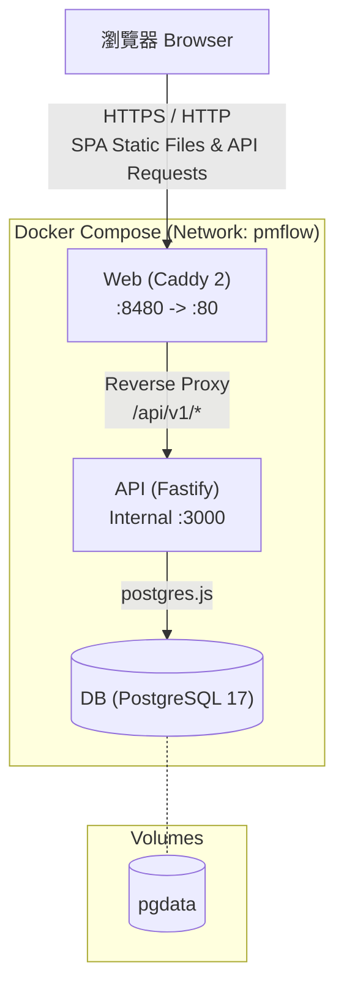
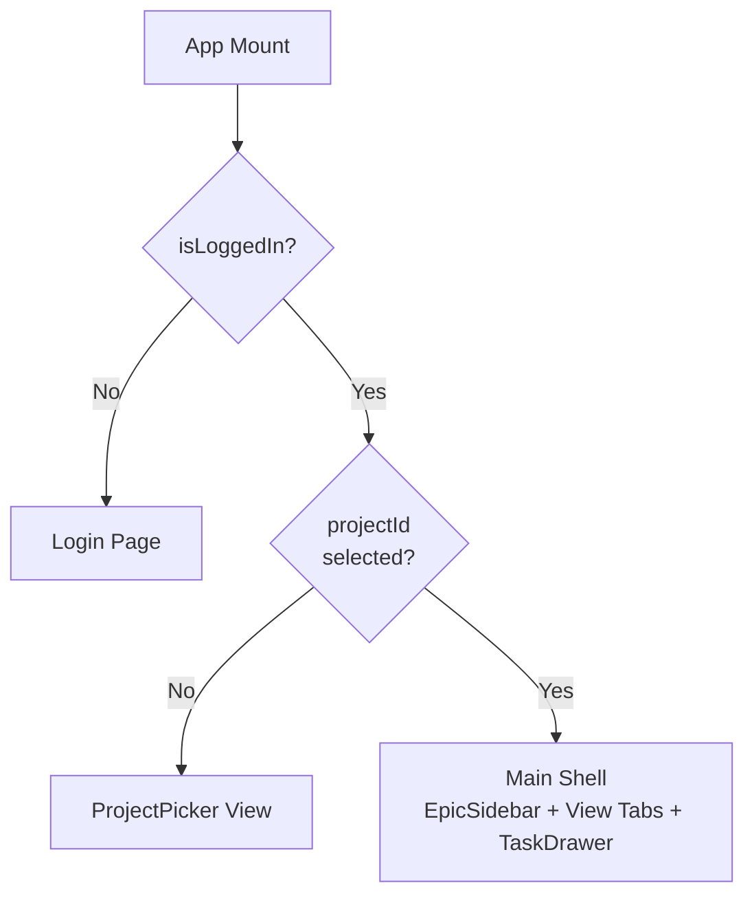
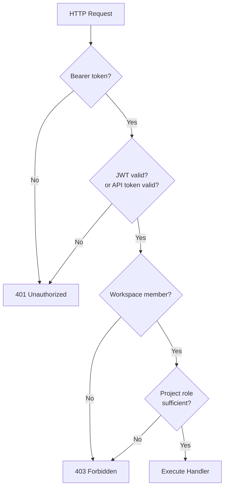
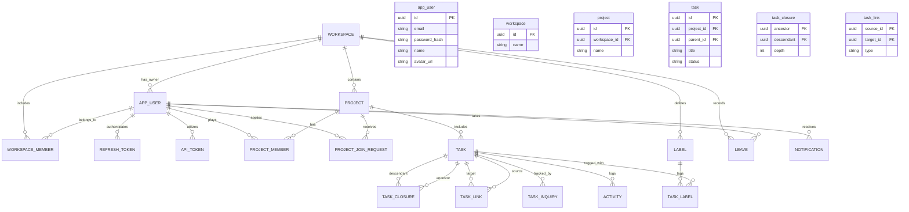

# PMFlow 系統架構設計 (System Architecture)

> **Last Updated:** 2026-08-12 | **Version:** 3.0.0
> 搭配 [CODEMAP.md](file:///D:/NewProject/pmflow-git/docs/CODEMAP.md) 閱讀以取得程式碼導覽與功能模組對應關係。

本文件描述 PMFlow 的實際系統架構、前端架構、後端架構及資料模型，作為開發與維護的基準。

## 1. 系統全景圖 (System Overview)

PMFlow 採用三容器 Docker Compose 架構，將前端靜態資源與後端 API 透過反向代理整合。

- **Web**: 提供 React 19 SPA，使用 Caddy 2 伺服器 (埠 8480 對應至內部 80)。Caddy 兼具反向代理功能，會將 `/api/v1/*` 請求轉發至 API 容器。
- **API**: 基於 Fastify 5 與 TypeScript 開發的後端服務，內部埠為 3000 (不對外暴露)。
- **DB**: 使用 PostgreSQL 17 Alpine，並包含健康檢查機制。

儲存卷 (Volumes):
- `pgdata`: PostgreSQL 的持久化儲存空間。

> [!NOTE]
> 目前架構**不包含** Redis/Valkey、WebSocket/STOMP、SMTP 或背景排程器 (僅依賴 API 容器內的 `setInterval` 進行過期掃描)。



## 2. 前端架構 (Frontend Architecture)

### 技術堆疊 (Technology Stack)

| Technology | Version | Purpose |
| --- | --- | --- |
| React | 19.1 | UI framework |
| Vite | 6.3 | Build tool |
| TypeScript | 5.8 | Type system |
| Tailwind CSS | 4.1 (v4) | Styling |
| TanStack Query | 5.80 | Server state |
| @xyflow/react | 12.8 | Graph/flow diagrams |
| dhtmlx-gantt | 10.0 (MIT) | Gantt chart |
| @dnd-kit/core | 6.3 | Drag and drop |
| @dnd-kit/sortable | 10.0 | Sortable lists |

### 頁面結構 (Page Structure)

前端**不使用** React Router，而是透過 [App.tsx](file:///D:/NewProject/pmflow-git/src/App.tsx) 內部的狀態驅動 (State-driven) 來切換視圖。包含 Login.tsx (未登入狀態) 與 ProjectPicker.tsx (未選擇專案狀態)。

| Key | Label | Icon | Lazy? | File |
| --- | --- | --- | --- | --- |
| list | 清單 | 📋 | No | [List.tsx](file:///D:/NewProject/pmflow-git/src/pages/List.tsx) |
| board | 看板 | 📊 | No | [Board.tsx](file:///D:/NewProject/pmflow-git/src/pages/Board.tsx) |
| week | 週檢視 | 📅 | No | [Week.tsx](file:///D:/NewProject/pmflow-git/src/pages/Week.tsx) |
| calendar | 行事曆 | 🗓️ | No | [Calendar.tsx](file:///D:/NewProject/pmflow-git/src/pages/Calendar.tsx) |
| gantt | 甘特圖 | 📈 | Yes | [Gantt.tsx](file:///D:/NewProject/pmflow-git/src/pages/Gantt.tsx) |
| simpleGraph | 任務關聯圖 | 🔗 | Yes | [TaskGraph.tsx](file:///D:/NewProject/pmflow-git/src/pages/TaskGraph.tsx) |
| inquiry | 發文追蹤 | 📨 | No | [InquiryBoard.tsx](file:///D:/NewProject/pmflow-git/src/pages/InquiryBoard.tsx) |
| members | 成員 | 👥 | No | [Members.tsx](file:///D:/NewProject/pmflow-git/src/pages/Members.tsx) |
| dashboard | 儀表板 | 📉 | Yes | [Dashboard.tsx](file:///D:/NewProject/pmflow-git/src/pages/Dashboard.tsx) |

### 元件架構 (Component Architecture)

```text
src/
├── pages/              # 12 files (listed above)
├── components/         # 14 files
│   ├── ui.tsx          # Design system: Button, Input, Spinner, Modal, Badge, Card, cx
│   ├── EpicSidebar.tsx # Left sidebar: project hierarchy tree
│   ├── TaskDrawer.tsx  # Right panel: task detail editing
│   ├── InquiryTable.tsx # Cross-unit inquiry tracking table
│   ├── MembersPanel.tsx # Member management & join requests
│   ├── AccountPanel.tsx # User profile, password, OAuth identity
│   ├── AdminPanel.tsx   # Workspace administration
│   ├── NotificationBell.tsx # Header notification dropdown
│   ├── BurndownChart.tsx # Hand-crafted SVG burndown chart
│   ├── WorkloadHeatmap.tsx # Hand-crafted SVG workload heatmap
│   ├── ProjectSettings.tsx # Project status/type customization
│   ├── Avatar.tsx       # User avatar with initials fallback
│   ├── ProviderIcon.tsx # OAuth provider SVG icons
│   └── UserMenu.tsx     # Header user dropdown
├── lib/                # 9 utility files
│   ├── api.ts          # All API types + fetch functions + 401 auto-refresh
│   ├── auth.tsx        # Auth context, JWT in-memory, refresh via cookie
│   ├── theme.tsx       # Dark/light mode toggle
│   ├── date.ts         # Working day calculations
│   ├── hierarchy.ts    # Closure table tree builder
│   ├── linkText.ts     # Dependency type human-readable labels
│   ├── remember.ts     # useRemembered hook for localStorage
│   ├── rollup.ts       # Parent task progress rollup
│   └── useUnreadNotifications.ts
├── strings/            # 13 localization files (zh-TW centralized strings)
├── App.tsx             # Auth gate → ProjectPicker → Main shell (tabs + sidebar)
├── main.tsx            # Mounts React with QueryClient + AuthProvider + ThemeProvider
└── index.css           # Tailwind v4 styles
```

### 導覽與認證流程 (Navigation & Auth Flow)



### 狀態管理 (State Management)
- **Server state**: TanStack Query (快取鍵值例如 `['tasks', projectId]`)
- **Auth state**: React Context (JWT access token 存放於記憶體，refresh token 存放於 httpOnly cookie)
- **UI state**: React `useState` (如 view, selectedTask, epicFilter 等)
- **Persistence**: 透過自訂 Hook `useRemembered` 存取 localStorage (如頁籤順序、視圖配置、主題設定)
- **NO Redux, NO Zustand**: 系統不依賴全域狀態管理庫。

### TaskGraph 任務關聯圖架構 (TaskGraph Architecture)
- 基於 `@xyflow/react` (React Flow) 開發。
- 單一節點類型 `simpleNode`，具備雙重模式 (Dual mode): card 或 box。
- 每個節點擁有 8 個控制點 (handles，4 方向 × in/out)：
  - 左右 (Left/Right) 控制點: 藍紫色 (#6366f1)
  - 上下 (Top/Bottom) 控制點: 琥珀色 (#f59e0b)
- 收納盒 (Storage box)：透過 `NodeResizeControl` 調整大小，提供自動網格佈局 (5 列/欄，欄寬 280px，列高 100px)。
- 連結規則：禁止自我循環連結 (no self-loop)、禁止跨界連結 (box ↔ outside)、禁止重複連結。
- 拖曳規則：帶有關聯線的卡片無法離開 box；切換模式時會自動釋放子節點。
- 視圖配置 (Viewport persistence)：存放在 localStorage 的 `pmflow_simple_graph_viewport`。
- Box 最小尺寸：320×220；網格槽位偏移量：`{x: 24+cIdx*280, y: 50+rIdx*100}`。

## 3. 後端架構 (Backend Architecture)

### 技術堆疊 (Technology Stack)

| Technology | Version | Purpose |
| --- | --- | --- |
| Fastify | 5.3 | HTTP framework |
| TypeScript | 5.8 | Language |
| postgres (porsager) | 3.4 | PostgreSQL driver (raw SQL, not ORM) |
| zod | 3.25 | Request validation |
| jose | 6.0 | JWT signing/verification |
| @fastify/cookie | 12.0 | Cookie handling |
| @fastify/cors | 11.0 | CORS |
| @fastify/multipart | 9.0 | File uploads |

### 後端模組 (Backend Modules)

```text
apps/api/src/
├── index.ts            # Fastify setup, route registration at /api/v1, migration runner, overdue sweep interval
├── seed.ts             # Demo data seeder (2 projects, demo user)
├── lib/
│   ├── env.ts          # Environment variable parsing
│   ├── db.ts           # postgres connection + append-only migration runner with SHA-256 checksum
│   ├── auth.ts         # scrypt password hashing, JWT, authenticate preHandler, role checks
│   ├── errors.ts       # RFC 7807 problem+json helpers
│   ├── graph.ts        # Link types, closure table rebuild, cycle detection (DFS on links ∪ parents)
│   ├── schedule.ts     # CPM engine: topological sort, forward/backward pass, critical path, conflicts
│   ├── inquiry.ts      # Inquiry state recalculation, overdue sweep
│   ├── burndown.ts     # Burndown chart: activity replay for historical snapshots
│   ├── rank.ts         # Fractional ranking for drag-and-drop sort
│   └── breakglass.ts   # Emergency password reset file watcher (disabled by default)
├── routes/
│   ├── auth.ts         # register/login/refresh/logout/me
│   ├── oauth.ts        # Google + Apple OAuth 2.0 flows
│   ├── projects.ts     # Project CRUD, /graph, /schedule
│   ├── members.ts      # Members, join requests, workspace users
│   ├── tasks.ts        # Task CRUD, move, reschedule
│   ├── links.ts        # Dependency link CRUD with cycle prevention
│   ├── inquiries.ts    # Cross-unit inquiry tracking + board + stats
│   ├── notifications.ts # User notifications
│   ├── leaves.ts       # Team leave management
│   ├── dashboard.ts    # Burndown + workload data
│   ├── parameters.ts   # Project settings (statuses, types)
│   └── account.ts      # Password change, API token management
└── migrations/
    ├── 0001_init.sql    # Core schema (17 tables + 2 views)
    ├── 0002_*.sql       # Join requests
    └── 0003_*.sql       # Leaves + notifications
```

### 認證與權限 (Auth & Permissions)

- **密碼雜湊**: Node 原生 `crypto.scrypt` (非 Argon2)。
- **Access Token**: JWT (透過 `jose` 簽發)，效期 15 分鐘，於 API 回應本體返回 (前端存於記憶體)。
- **Refresh Token**: 隨機 16 進制字串，存放在 httpOnly cookie `pmflow_rt`，效期 30 天，具備輪替 (Rotation) 與重用偵測 (Reuse detection) 機制。
- **API Tokens**: 以 `pmflow_` 作為前綴，資料庫儲存其 SHA-256 雜湊值，權限等同於發行者。
- **OAuth**: 支援 Google 與 Apple OIDC 流程。
- **Workspace Roles**: OWNER / ADMIN / MEMBER。
- **Project Roles**: MANAGER / EDITOR / VIEWER（Ref: CR-145 —— COMMENTER 已移除）。



### 排程引擎 (Schedule Engine)

- 位於 [schedule.ts](file:///D:/NewProject/pmflow-git/apps/api/src/lib/schedule.ts) 的客製化 CPM (關鍵路徑法) 實作。
- 在任務 DAG (包含 Links 與 Parent edges) 上執行拓撲排序 (Topological sort)。
- **Forward pass**: 計算最早開始/結束時間 (Earliest start/finish)，支援 FS/SS/FF/SF 與延遲 (Lag)。
- **Backward pass**: 計算最晚開始/結束時間 (Latest start/finish) 與總浮動時間 (Total float)。
- 關鍵路徑 (Critical path) = Total float 為 0 的任務。
- `MANUAL` 模式的任務為固定錨點，`AUTO` 模式的任務則由引擎計算日期。
- 透過 `/schedule` 與 `/reschedule` 端點按需執行。

### 核心演算法 (Core Algorithms)

| Algorithm | Location | Description |
| --- | --- | --- |
| Cycle detection | [graph.ts](file:///D:/NewProject/pmflow-git/apps/api/src/lib/graph.ts) | DFS 偵測循環依賴 (針對 links ∪ parent edges) |
| Closure table | [graph.ts](file:///D:/NewProject/pmflow-git/apps/api/src/lib/graph.ts) | 任務搬移時重建祖先-後代關係 (Ancestor-descendant rows) |
| CPM scheduling | [schedule.ts](file:///D:/NewProject/pmflow-git/apps/api/src/lib/schedule.ts) | Forward/backward pass 計算關鍵路徑 |
| Fractional ranking | [rank.ts](file:///D:/NewProject/pmflow-git/apps/api/src/lib/rank.ts) | 使用 `(a+b)/2` 進行排序插入，只需單行 UPDATE |
| Burndown replay | [burndown.ts](file:///D:/NewProject/pmflow-git/apps/api/src/lib/burndown.ts) | 按時間軸回放 activity 以產出歷史快照 |
| Inquiry rollup | [inquiry.ts](file:///D:/NewProject/pmflow-git/apps/api/src/lib/inquiry.ts) | 狀態計算權重: OVERDUE > PARTIAL > AWAITING > REPLIED > NONE |

## 4. 資料模型 (Data Model)



**Table Definitions:**
- `app_user`: 用戶基本資料與認證。
- `workspace`: 頂層工作空間。
- `workspace_member`: 工作空間成員及其角色 (OWNER, ADMIN, MEMBER)。
- `refresh_token`: 儲存 JWT refresh tokens，包含 rotation 追蹤。
- `api_token`: 儲存 `pmflow_` API tokens (SHA-256 hash)。
- `project`: 專案資訊，隸屬於 workspace。
- `project_member`: 專案成員及其角色 (MANAGER, EDITOR, VIEWER)。
- `project_join_request`: 使用者申請加入專案的請求紀錄。
- `task`: 任務本體 (支援 Epic / Task / Subtask / Milestone)。
- `task_closure`: 閉包表，用於 O(1) 查詢任務樹狀結構的所有後代/祖先。
- `task_link`: 任務間的依賴關係 (如 FS, SS, FF, SF, Blocks, RelatesTo)。
- `task_inquiry`: 跨單位發文追蹤紀錄。
- `activity`: 任務變更的 Audit log，用於燃盡圖 (Burndown chart) 歷史回放。
- `label`: 工作空間共用標籤。
- `task_label`: 任務與標籤的關聯表。
- `leave`: 團隊成員請假紀錄。
- `notification`: 系統通知。
- **Views**:
  - `v_inquiry`: 包含發文追蹤狀態的聚合視圖。
  - `v_unit_suggestion`: 自動建議單位的視圖。

## 5. Docker 部署架構 (Docker Architecture)

開發環境使用 `docker-compose.dev.yml` 啟動三個主要服務：

| Service | Port | Image / Source | Role |
| --- | --- | --- | --- |
| `web` | 8480:80 | Caddy 2 | Serve static SPA + Reverse proxy API |
| `api` | (Internal 3000) | Fastify 5 | Backend API Server |
| `db` | (Internal 5432) | PostgreSQL 17 Alpine | Database |

**Environment Variables:**

| Variable | Default | Description |
| --- | --- | --- |
| `WEB_PORT` | `8480` | External web port |
| `PG_USER` | `pmflow` | PostgreSQL user |
| `PG_PASSWORD` | `pmflow` | PostgreSQL password |
| `PG_DB` | `pmflow` | Database name |
| `JWT_SECRET` | `dev-jwt-secret-change-me` | JWT signing secret |
| `CORS_ORIGIN` | `*` | CORS allowed origins |
| `SEED_DEMO` | `true` | Seed demo data on startup |
| `GOOGLE_CLIENT_ID` | (empty) | Google OAuth ID |
| `GOOGLE_CLIENT_SECRET` | (empty) | Google OAuth Secret |
| `APPLE_*` | (empty) | Apple OAuth credentials |

## 6. 開發流程 (Development Workflow)

```bash
# Start development environment
docker compose -f docker-compose.dev.yml up --build -d web

# View logs
docker compose -f docker-compose.dev.yml logs -f api

# Rebuild after changes
docker compose -f docker-compose.dev.yml up --build -d web
```

**Migration Rules (資料庫遷移規則):**
- `migrations/` 目錄下的 SQL 檔案為 **Append-only**，絕對不可修改已建立的遷移檔案。
- 啟動時會驗證 SHA-256 Checksum，若有竄改將中斷啟動。
- 使用 Advisory lock 避免多實例同時執行遷移。

## 7. 效能與安全 (Performance & Security)

### 系統安全 (Security)
- 採用 `scrypt` 進行高強度密碼雜湊。
- JWT 搭配 Refresh Token 輪替與重用偵測 (Reuse detection)。
- Cookie 設定為 `httpOnly` 與 `Secure`。
- 服務層 (Service layer) 強制實施基於角色的存取控制 (RBAC)。
- API Token 僅儲存 SHA-256 雜湊，降低外洩風險。
- 錯誤回應遵循 RFC 7807 (Problem Details for HTTP APIs) 標準。

### 效能優化 (Performance)
- **Code splitting**: 對於 Gantt, TaskGraph, SystemFlow, Dashboard 等大型視圖進行 Lazy Load。
- **快取機制**: 前端使用 TanStack Query 進行伺服器狀態快取。
- **連線池**: 後端透過 `postgres.js` 提供高效率連線池。
- **重新排序效能**: 採用 Fractional ranking 演算法，拖曳排序時僅需執行單行 UPDATE。
- **樹狀結構查詢**: 採用 Closure table，查詢子樹為 O(1) 複雜度。

## 8. 授權政策 (License Policy)

所有依賴套件必須符合 MIT / Apache-2.0 / BSD / PostgreSQL License 等開源友善協議。
- `dhtmlx-gantt` 鎖定在 `^10` 版本 (該版本為 MIT 授權，早期版本為 GPL)。
- **禁用** `elkjs` (因其為 EPL-2.0 授權)。
- **無** Redis (因其 RSAL/SSPL 授權疑慮) → 系統目前無 Cache layer。
- CI 流程應包含 License 掃描確保合規。

## 9. 未來架構規劃 (Future Considerations)

- [ ] 導入 WebSocket / STOMP 以提供即時更新 (Real-time updates)
- [ ] 整合 SMTP 發送通知與逾期提醒信件
- [ ] 實作檔案附件儲存功能 (File attachment storage)
- [ ] 評估 Valkey (BSD-3) 作為快取與 Session 儲存
- [ ] 支援 Multi-arch Docker images (amd64 + arm64)
- [ ] 整合 Caddy auto-HTTPS 作為正式機 (Production) 的憑證管理
- [ ] 引入獨立的 Background job scheduler (目前僅依賴 setInterval)
