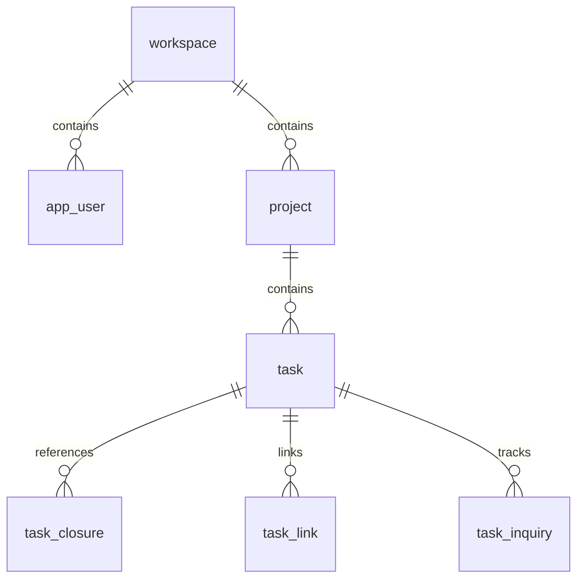

# PMFlow 系統規格書 (System Specification)

**Last Updated:** `2026-08-12`  
**Version:** `3.0.0`

---

## 0. 一句話定義 (Elevator Pitch)

PMFlow 是一套自架式專案管理系統，核心特色是「任務可以上下左右關聯」——上下是階層（父子任務＋閉包表），左右是時序依賴（FS/SS/FF/SF + lag），旁邊是語意關聯（relates / duplicates / blocks / requires）——並且內建跨單位發文追蹤。

---

## 1. 需求對照表 (Market Survey & Requirements)

以下是針對市面上主流專案管理系統的市場調查與需求對照。

| 系統 | 授權/價格 | 階層任務 (上下) | 時序相依 (左右) | 語意關聯 (旁邊) | 跨單位發文追蹤 |
| --- | --- | --- | --- | --- | --- |
| Jira | SaaS / 昂貴 | ✅ (Epic/Task/Sub) | ✅ (Link) | ✅ | ❌ |
| Asana | SaaS | ✅ | ✅ | ❌ | ❌ |
| ClickUp | SaaS | ✅ | ✅ | ✅ | ❌ |
| Redmine | GPLv2 (開源) | ✅ (無限制) | ✅ (Blocks) | ✅ | ❌ (需客製) |
| OpenProject | GPLv3 (開源) | ✅ | ✅ (FS) | ✅ | ❌ |
| Taiga | MPL (開源) | ❌ (僅 Epic) | ❌ | ❌ | ❌ |
| Plane | AGPLv3 (開源) | ✅ (少許) | ❌ | ❌ | ❌ |
| Focalboard | MIT (開源) | ❌ | ❌ | ❌ | ❌ |
| Leantime | GPLv2 (開源) | ❌ | ❌ | ❌ | ❌ |
| **PMFlow** | **MIT (自架)** | ✅ **(無限階層)** | ✅ **(4種相依)** | ✅ **(4種語意)** | ✅ **(內建)** |

### 三大關鍵結論：
1. **授權 (Licensing)：** 許多強大的自架系統採用 AGPL/GPL 授權，對於企業內部整合較不友善（容易觸發傳染條款）。PMFlow 堅持全端 MIT 授權。
2. **四種任務相依 (4-type dependencies)：** 大多數開源輕量級工具缺乏完整的 FS/SS/FF/SF 及 Lag 支援，無法畫出真正的甘特圖或計算要徑。
3. **跨單位發文追蹤 (Cross-unit inquiry tracking)：** 一般專案管理軟體缺乏「對外發文與催辦」的概念。PMFlow 將發文追蹤作為一級公民內建，解決跨部門協作中的黑洞問題。

---

## 2. 技術選型 (Technology Stack)

本專案採前後端分離架構。

### Frontend (actual)

| 用途 | 選用 | 版本 | 授權 |
| --- | --- | --- | --- |
| 框架 | React + TypeScript + Vite | 19.1 / 5.8 / 6.3 | MIT |
| 樣式 | Tailwind CSS v4 | 4.1 | MIT |
| 通用拖曳 | @dnd-kit/core + sortable | 6.3 / 10.0 | MIT |
| 甘特圖 | dhtmlx-gantt | ^10.0.1 | MIT (⚠️ ≤9 is GPL) |
| 行事曆 | Custom (手刻月曆+拖曳) | — | — |
| 關聯網路圖 | @xyflow/react (React Flow) | 12.8 | MIT |
| 圖表 | 手刻 SVG (BurndownChart, WorkloadHeatmap) | — | — |
| 伺服器狀態 | TanStack Query | 5.80 | MIT |

### Backend (actual)

| 用途 | 選用 | 版本 | 授權 |
| --- | --- | --- | --- |
| HTTP 框架 | Fastify | 5.3 | MIT |
| 語言 | TypeScript (tsx runner) | 5.8 | MIT |
| 資料庫驅動 | postgres (porsager) | 3.4 | MIT |
| 驗證 | zod | 3.25 | MIT |
| JWT | jose | 6.0 | MIT |
| 反向代理 | Caddy 2 | — | Apache-2.0 |
| 資料庫 | PostgreSQL 17 Alpine | — | PostgreSQL License |

### Important Notes:
- **No ORM**: 不使用 Prisma 或 TypeORM，全面使用 raw SQL via `postgres.js` tagged template。
- **No Redis/Valkey**: 尚未實作快取層，所有資料均即時由 PostgreSQL 查詢。
- **No WebSocket/STOMP**: 尚未實作即時通訊，前端依賴輪詢或手動刷新。
- **No SMTP/email**: 尚未實作電子郵件發送。
- **No Zustand**: 伺服器狀態完全交由 TanStack Query 處理，UI 狀態使用 React `useState`。
- **No shadcn/ui package**: 使用自訂的 UI 元件庫（如 `Button`, `Input`, `Modal` 等），並非依賴外部 UI 庫。
- **Charts are hand-crafted SVG**: 燃盡圖與熱力圖皆為手刻 SVG，不使用 Recharts 或 ECharts，確保完全的客製化與輕量化。
- **Calendar is custom**: 行事曆為手刻實作，不使用 `react-big-calendar`。
- **Layout algorithms**: `Graph.tsx` 中的佈局演算法為自訂開發（無 `elkjs`，因 EPL-2.0 授權限制）。

### 授權地雷 (License Traps)

在技術選型過程中，我們避開了以下容易踩坑的開源套件：
- ⚠️ **wx-react-gantt**: GPLv3 授權陷阱。
- ⚠️ **FullCalendar premium**: GPL 授權。
- ⚠️ **Schedule-X premium**: 商業授權。
- ⚠️ **dhtmlx-gantt ≤9**: 舊版本為 GPL 授權（必須使用 ^10 之後的 MIT 版本）。
- ⚠️ **MinIO**: 已歸檔且改為 AGPL。
- ⚠️ **Redis**: 改為 RSAL/SSPL 雙授權。
- ⚠️ **elkjs**: EPL-2.0 授權（有傳染風險）。

---

## 3. 功能規格 (Feature Specifications)

### 3.1 全域導覽 (Global Navigation)

- **無 React Router**: PMFlow 不使用傳統的 React Router。視圖切換完全由狀態（State-driven）驅動。
- **Auth flow**: 登入畫面 → ProjectPicker (專案選擇) → Main shell (主應用程式殼層)。
- **Main shell 佈局**: 左側 EpicSidebar（史詩側欄） + 頂部 Tab bar（頁籤列） + 中間 Content（主要內容） + 右側 TaskDrawer（任務詳情覆疊）。
- **Tab bar**: 支援拖曳排序、隱藏/顯示頁籤，並且狀態持久化儲存於 localStorage 中。
- **檢視模式 (Views)**: 清單、看板、行事曆（內含週檢視）、甘特圖、**任務關聯圖**、**系統流程圖**、
  **各語法範例**、儀表板、對外詢問、事件歸屬。
  （Ref: CR-142 —— 舊的 `Graph.tsx` 已刪除，「任務關聯圖」現在是 `SimpleGraph.tsx`。）
- **Lazy Loading**: 較為吃資源的檢視（Gantt, SimpleGraph, SystemFlow, Playground, Dashboard）採延遲載入。
- **任務詳情 (Task Detail)**: 點擊任務時，會從右側滑出 TaskDrawer 面板，**不會**跳轉到獨立的路由頁面。

### 3.2 清單視圖 (List View)

- 顯示 WBS（Work Breakdown Structure）階層結構（Epic → Task → Subtask）。
- 支援樹狀展開與收合。
- 支援依照狀態（Status）或類型（Type）進行分組，分組區塊可折疊。
- 已完成（Completed）的任務會以灰色加上刪除線顯示。

### 3.3 看板 (Board)

- 欄位（Columns）對應任務的狀態（Customizable per project）。
- 透過拖曳卡片（使用 `@dnd-kit/core`）在不同欄位間移動，自動改變任務狀態。
- 卡片上會顯示發文追蹤標籤（Inquiry badges）：⏳ (等待中) / ⚠️ (逾期) / ✅ (已回覆)。

### 3.4 週檢視 (Week View)

- 顯示當週已排程的任務。
- 依照一週的每一天進行拆分顯示。
- 支援依照類型或狀態進行分組並折疊。

### 3.5 行事曆 (Calendar)

- 客製化手刻的月曆視圖。
- 支援跨日任務條狀顯示（Cross-day task bars）。
- 支援拖曳任務條來改變起始與結束日期。
- **請假系統整合**：行事曆上會直接顯示團隊成員的請假紀錄，方便掌握人力資源。
- 支援請假期間的代理人（Delegate）顯示。

### 3.6 甘特圖 (Gantt)

- 使用 `dhtmlx-gantt ^10` (MIT)。
- 支援任務間的相依性箭頭繪製（FS/SS/FF/SF）。
- **要徑突顯 (Critical path highlighting)**：由後端排程引擎計算，前端負責高亮顯示。
- 支援在甘特圖上直接拖曳改變排程。
- 技術細節：因為 dhtmlx-gantt 是 imperative API，所以將其封裝在 React ref 內部操作，而不是透過 React state 驅動。

### 3.7 任務關聯圖 (`SimpleGraph.tsx`)

> Ref: CR-142 —— 舊的 `Graph.tsx`（union-find 自動佈局的 DAG 檢視）**已於 2026-08-17 刪除**，
> 它早就不在頁籤清單上、使用者點不到。頁籤「任務關聯圖」現在對應的是這一頁。

- 基於 `@xyflow/react` (React Flow)，佈局自己寫（不使用 `elkjs`，EPL-2.0 過不了授權掃描）。
- **關聯線一律直角**（Ref: CR-131／CR-139）：不用貝茲、不用圓角。
  **轉角可以拖曳**，雙擊把手回到自動位置。拉線當下的預覽線也是直角
  （`connectionLineType` 沒設的話 React Flow 預設是貝茲，那是兩套渲染）。
- **文字註記與區域標示框**（Ref: CR-144）：兩者都**不是任務**，只在渲染階段疊上畫布，
  不會呼叫任何任務 API。標示框墊在最底層且不吃點擊，也**不會**把拖進去的卡片變成它的子節點。

### 3.8 節點與收納盒細節
- **單一節點類型 (`simpleNode`)**：具備卡片 (card) 與收納盒 (box) 雙模式。
- **8 個雙向連接點 (Handles)**：4 個方向 (上/下/左/右) × 進入/離開。
- **連接點顏色定義**：左/右 = indigo (靛藍)；上/下 = amber (琥珀黃)。
- **收納盒設計**：
  - 支援調整大小 (`NodeResizeControl`)。
  - 內部自動格狀佈局（Grid layout）：5 欄/列，欄寬 280px，列高 100px。
  - 最小尺寸限制：320 × 220。
  - 內部卡片的定位偏移 (Slot offset)：`{x: 24+cIdx*280, y: 50+rIdx*100}`。
- **連線規則**：禁止自我連線 (No self-loop)、禁止跨界連線 (No cross-boundary)、禁止重複連線 (No duplicates)。
- **拖曳限制規則**：
  - 有邊界連線的卡片不能拖離收納盒。
  - 切換模式時會自動釋放子節點。
- **視角狀態保存**：Viewport 狀態記錄於 `localStorage` 的 `pmflow_simple_graph_viewport` 鍵值中。
- **防呆警告對話框 (Alert modals)**：
  - 阻擋跨界連線。
  - 阻擋重複連線。
  - 阻擋有連線的卡片離開收納盒。
- **刪除連線**：點擊關聯線條 (Edge) 會跳出確認對話框：「是否刪除 [A] 與 [B] 的關聯？」

### 3.8.1 系統流程圖 (`SystemFlow.tsx`)

畫「這套系統怎麼運作」用的自由畫布，**節點不是任務**，整頁是一份文件。（Ref: CR-140）

- **模組容器**：可裝流程步驟，容器內顯示標題與**詳細說明**（超長截斷、滑過看全文、沒填不佔位）。
- **流程步驟卡片**、**文字註記**（無框無底色的說明字）、**區域標示框**（純視覺標示，
  墊最底層、不吃點擊、不建立隸屬關係）。
- **關聯線**：直角、轉角可拖、線上可以掛文字（標籤跟著轉角走，拖完不會飄在半空中）。
- **箭頭永遠指向終點**：React Flow 內部在「從輸入接點起拉」時會自己把兩端對調，這一頁修正回來。
- 多分頁，可改名與排序。

### 3.8.2 各語法範例 (`Playground.tsx`)

Markdown／SQL／Java／網頁語法的範例與即時預覽。Markdown 走 `markdown-it`(MIT) +
`highlight.js`(BSD-3)，`html:false` 預設擋掉原始 HTML 注入，因此不需要額外的消毒套件
（`dompurify` 是 MPL-2.0，過不了授權關卡）。程式碼區塊支援 TypeScript 高亮。（Ref: CR-135）

### 3.9 發文追蹤 (Inquiry Tracking)

這是 PMFlow 的**殺手級功能**。為解決跨單位溝通中的「黑洞」，我們將發文追蹤設為一級公民。
- **跨單位發文系統**：記錄「發給哪個單位」、「回覆了沒」、「最後是由誰回覆的」。
- `asked_to_unit` 與 `replied_by_unit` 分開設計：這是因為發文給 A 單位，A 單位可能會轉交給 B 單位回覆，必須保留原始發文目標與實際回覆單位的資訊。
- **右側面板內建追蹤**：TaskDrawer 內建發文追蹤表格，無需切換畫面。
- **跨專案追蹤看板 (`InquiryBoard.tsx`)**：可在單一畫面總覽所有專案的發文進度。
- **智慧單位建議 (Unit typeahead)**：基於歷史資料 (`v_unit_suggestion`) 提供單位輸入建議。
- **發文狀態 (Inquiry states)**：
  - `NONE`: 無發文
  - `AWAITING`: 等待回覆中
  - `OVERDUE`: 逾期未回覆
  - `PARTIAL`: 部分回覆
  - `REPLIED`: 全部已回覆
- **每日逾期掃描**：後端透過 `setInterval` 每日掃描並更新逾期狀態。
- **卡片徽章標示**：在清單與看板上顯示 ⏳, ⚠️, ✅，一眼看出任務卡在哪裡。
- **單位統計分析**：計算各單位的「平均回覆天數」與「逾期率」。

### 3.10 成員 (Members)

- 顯示專案成員清單及其角色（Role）。
- 支援透過 Email 邀請成員加入。
- 支援加入請求（Join request）系統，適用於公開專案。
- 支援檢視整個工作區（Workspace）的成員列表。

### 3.11 儀表板 (Dashboard)

- **燃盡圖 (Burndown chart)**：手刻 SVG 繪製。包含三條線：理想線 (ideal)、實際線 (actual)、趨勢線 (trend)。支援十字準線 (crosshair) 與表格模式。後端透過重播活動歷史 (Replays activity history) 產生資料。
- **工作量熱力圖 (Workload heatmap)**：手刻 SVG 繪製。呈現每位成員每日的工時負載。包含顏色漸層 (color scale)、超載警告三角形 (overload triangles)、請假斜線標示 (leave diagonal lines)，以及表格模式。
- 不使用任何外部圖表庫，確保最高效能與樣式控制。

### 3.12 請假與代理 (Leaves)

- 團隊請假管理深度整合於行事曆 (Calendar) 視圖中。
- 支援設定請假類型、日期區間、備註說明。
- **代理人設定 (Delegate assignment)**：可指定請假期間由誰代理業務。

---

## 4. 資料模型 (Data Model)

### 4.1 任務「上下左右」關聯

PMFlow 將任務間的關聯定義為三個維度：
- **上下 (階層)**: 透過 `parent_id` 與 `task_closure` (閉包表) 達成無限階層的父子結構查詢。
- **左右 (時序)**: 透過 `task_link` 定義排程相依性 (FS/SS/FF/SF) 與延遲 (Lag)，影響甘特圖與要徑。
- **旁邊 (語意)**: 同樣存在 `task_link`，但作為標籤性質的語意關聯 (RELATES/BLOCKS/DUPLICATES/REQUIRES)，不影響時序排程。

### 4.2 完整資料表 (Database Schema)



**核心表 (Core tables)**:
- `workspace`: (id, name, created_at)
- `app_user`: (id, email, password_hash, created_at)
- `workspace_member`: (workspace_id, user_id, role)
- `refresh_token`: (token, user_id, expires_at)
- `api_token`: (id, user_id, token_hash, name, created_at)

**專案表 (Project tables)**:
- `project`: (id, workspace_id, name, is_public, created_at)
- `project_member`: (project_id, user_id, role)
- `project_join_request`: (id, project_id, user_id, status, created_at)

**任務表 (Task tables)**:
- `task`: (id, project_id, title, description, status, type, parent_id, start_date, due_date, assignee_id, rank, estimated_hours, actual_hours, created_at, updated_at, inquiry_state, ... 共計 25+ 欄位)
- `task_closure`: (ancestor_id, descendant_id, depth)
- `task_link`: (id, source_id, target_id, type, lag, created_at)
- `task_inquiry`: (id, task_id, asked_to_unit, expected_date, replied_date, replied_by_unit, status, created_at)

**輔助表 (Supporting tables)**:
- `activity`: (id, task_id, user_id, action, old_value, new_value, created_at)
- `label`: (id, project_id, name, color)
- `task_label`: (task_id, label_id)
- `leave`: (id, user_id, project_id, start_date, end_date, type, delegate_id, note)
- `notification`: (id, user_id, type, reference_id, is_read, created_at)

**視圖 (Views)**:
- `v_inquiry`: 彙整發文追蹤的即時狀態 (等待中、逾期等)。
- `v_unit_suggestion`: 從 `task_inquiry` 萃取歷史單位名稱，供前端 typeahead 使用。

### 4.3 Link Types (任務關聯類型)

| 存的值 | 介面顯示 | 類型 | 約束式 |
| --- | --- | --- | --- |
| FS | 完成後開始 | 時序排程 | `target.start >= source.finish + lag` |
| SS | 同時開始 | 時序排程 | `target.start >= source.start + lag` |
| FF | 同時完成 | 時序排程 | `target.finish >= source.finish + lag` |
| SF | 開始後完成 | 時序排程 | `target.finish >= source.start + lag` |
| RELATES | 相關 | 語意關聯 | — |
| BLOCKS | 阻擋 | 語意關聯 | — |
| DUPLICATES | 重複於 | 語意關聯 | — |
| REQUIRES | 需要 | 語意關聯 | — |

### 4.4 跨單位發文追蹤 (Inquiry Tracking Data Model)

**設計哲學**：
- `asked_to_unit` (發文目標) 與 `replied_by_unit` (實際回覆單位) 被設計為獨立欄位。真實世界中，發文給 A 單位，最後可能由 B 單位代為回覆。這兩個欄位的拆分能精準備存查歷史軌跡。
- `v_inquiry` view：由於狀態 (逾期) 是與當前時間相關的動態資訊，我們使用 View 來動態計算狀態，而不是寫死在表中。
- `v_unit_suggestion` view：自動收集過去輸入過的單位名稱（包含發文目標與實際回覆單位），建立去重的字典，供前端輸入框自動完成。
- `inquiry_state` rollup：在 `task` 表中快取了一份 rollup 的狀態，方便在列表頁直接讀取徽章狀態，避免 N+1 查詢。

---

## 5. API 規格 (API Specifications)

**Base URL:** `/api/v1`

### Auth (身分驗證)
| Method | Path | Auth | Description |
| --- | --- | --- | --- |
| POST | `/auth/register` | No | Email + password 註冊 |
| POST | `/auth/login` | No | 登入，回傳 Access Token，寫入 Refresh Cookie |
| POST | `/auth/refresh` | Cookie | 輪替 (Rotate) refresh token |
| POST | `/auth/logout` | Cookie | 清除 refresh cookie |
| GET | `/auth/me` | Bearer | 取得當前使用者資料 |

### OAuth (第三方登入)
| Method | Path | Auth | Description |
| --- | --- | --- | --- |
| GET | `/oauth/google` | No | 跳轉 Google OAuth |
| GET | `/oauth/google/callback` | No | Google 回呼處理 |
| GET | `/oauth/apple` | No | 跳轉 Apple OAuth |
| POST | `/oauth/apple/callback` | No | Apple 回呼處理 |
| DELETE | `/oauth/:provider` | Bearer | 解除綁定第三方帳號 |

### Account (帳號設定)
| Method | Path | Auth | Description |
| --- | --- | --- | --- |
| PUT | `/account/password` | Bearer | 變更密碼 |
| GET | `/account/api-tokens` | Bearer | 列出 API Tokens |
| POST | `/account/api-tokens` | Bearer | 建立新的 API Token |
| DELETE | `/account/api-tokens/:id` | Bearer | 撤銷 API Token |

### Projects (專案管理)
| Method | Path | Auth | Description |
| --- | --- | --- | --- |
| GET | `/projects` | Bearer | 列出使用者參與的專案 |
| POST | `/projects` | Bearer | 建立新專案 |
| PATCH | `/projects/:id` | MANAGER | 更新專案設定 |
| GET | `/projects/public` | Bearer | 列出公開專案 |
| GET | `/projects/:id/graph` | Member | 取得關聯圖所需資料 |
| GET | `/projects/:id/schedule` | Member | 取得排程與要徑計算結果 |

### Members (成員管理)
| Method | Path | Auth | Description |
| --- | --- | --- | --- |
| GET | `/projects/:id/members` | Member | 列出專案成員 |
| POST | `/projects/:id/members` | MANAGER | 新增成員 |
| PATCH | `/projects/:id/members/:userId` | MANAGER | 更新成員角色 |
| DELETE | `/projects/:id/members/:userId` | MANAGER | 移除成員 |
| GET | `/projects/:id/join-requests` | MANAGER | 列出加入請求 |
| POST | `/projects/:id/join-requests` | Bearer | 提交加入公開專案請求 |
| POST | `/join-requests/:id/approve` | MANAGER | 核准加入請求 |
| POST | `/join-requests/:id/reject` | MANAGER | 拒絕加入請求 |
| GET | `/workspace-users` | Bearer | 取得工作區所有成員 |

### Tasks (任務管理)
| Method | Path | Auth | Description |
| --- | --- | --- | --- |
| GET | `/projects/:id/tasks` | Member | 列出專案任務 |
| POST | `/projects/:id/tasks` | EDITOR+ | 建立新任務 |
| PATCH | `/tasks/:id` | EDITOR+ | 更新任務內容 |
| DELETE | `/tasks/:id` | EDITOR+ | 軟刪除任務 |
| POST | `/tasks/:id/move` | EDITOR+ | 移動任務 (變更父節點/排序/狀態) |
| POST | `/tasks/:id/reschedule` | EDITOR+ | 重新排程任務日期 |
| GET | `/tasks/:id/activities` | Member | 取得任務活動歷史紀錄 |

### Links (任務關聯)
| Method | Path | Auth | Description |
| --- | --- | --- | --- |
| GET | `/projects/:id/links` | Member | 列出專案內的任務關聯 |
| POST | `/links` | EDITOR+ | 建立關聯 (包含循環依賴檢查) |
| DELETE | `/links/:id` | EDITOR+ | 刪除關聯 |

### Inquiries (發文追蹤)
| Method | Path | Auth | Description |
| --- | --- | --- | --- |
| GET | `/tasks/:id/inquiries` | Member | 列出任務的發文追蹤 |
| POST | `/tasks/:id/inquiries` | EDITOR+ | 建立發文追蹤 |
| PATCH | `/inquiries/:id` | EDITOR+ | 更新發文資訊 |
| POST | `/inquiries/:id/mark-replied` | VIEWER+ | 標記為已回覆 |
| POST | `/inquiries/:id/reopen` | EDITOR+ | 重新開啟發文 |
| DELETE | `/inquiries/:id` | EDITOR+ | 刪除發文追蹤 |
| GET | `/workspaces/:ws/inquiry-board` | Bearer | 取得跨專案發文看板資料 |
| GET | `/workspaces/:ws/inquiry-stats` | Bearer | 取得單位回覆統計數據 |
| GET | `/workspaces/:ws/unit-suggestions` | Bearer | 取得單位自動完成建議 |

### Dashboard (儀表板資料)
| Method | Path | Auth | Description |
| --- | --- | --- | --- |
| GET | `/projects/:id/burndown` | Member | 取得燃盡圖計算資料 |
| GET | `/projects/:id/workload` | Member | 取得工作量熱力圖資料 |

### Leaves (請假管理)
| Method | Path | Auth | Description |
| --- | --- | --- | --- |
| GET | `/projects/:id/leaves` | Member | 列出團隊請假紀錄 |
| POST | `/projects/:id/leaves` | Member | 新增請假紀錄 |
| PATCH | `/leaves/:id` | Bearer | 更新請假紀錄 |
| DELETE | `/leaves/:id` | Bearer | 刪除請假紀錄 |

### Notifications (通知)
| Method | Path | Auth | Description |
| --- | --- | --- | --- |
| GET | `/notifications` | Bearer | 列出未讀通知 |
| PUT | `/notifications/:id/read` | Bearer | 標記通知為已讀 |

### Parameters (專案參數)
| Method | Path | Auth | Description |
| --- | --- | --- | --- |
| GET | `/projects/:id/parameters` | Member | 取得專案自訂參數 |
| PUT | `/projects/:id/parameters` | MANAGER | 更新專案自訂參數 |

### Error Format (RFC 7807)
所有 API 錯誤回應皆遵循 RFC 7807 problem+json 格式。範例：
```json
{
  "type": "https://pmflow.dev/errors/cyclic-dependency",
  "title": "會造成循環依賴",
  "status": 409,
  "detail": "PMF-12 → PMF-45 → PMF-12"
}
```

---

## 6. 帳號與權限 (Auth & Permissions)

### Registration (註冊機制)
- 支援 Email + 密碼註冊 (密碼使用 `scrypt` 進行 hash 雜湊處理)。
- 系統初始化的第一個註冊使用者，將自動成為預設 Workspace 的 `OWNER`。
- 支援選擇性掛載 Google / Apple OAuth 第三方登入。

### Token Strategy (憑證策略)
- **Access Token**: 使用 JWT 格式，效期短 (15 分鐘)，儲存於前端記憶體中 (in-memory)。
- **Refresh Token**: 隨機 Hex 字串，透過 `httpOnly` cookie (`pmflow_rt`) 儲存，效期 30 天。支援 token rotation 及 reuse detection (防重放攻擊)。
- **API Tokens**: 個人存取權杖，皆以 `pmflow_` 作為前綴，資料庫內僅儲存其 SHA-256 雜湊值。

### Permission Matrix (權限矩陣)

> 角色只有三級（Ref: CR-145）。`COMMENTER`（可留言）已移除 —— 任務留言功能改成
> 「成立問題單」之後它沒有任何專屬權限，實際等同 VIEWER。

| 操作 | MANAGER | EDITOR | VIEWER |
| --- | :---: | :---: | :---: |
| 專案設定修改 | ✅ | ❌ | ❌ |
| 成員權限變更 | ✅ | ❌ | ❌ |
| 新增/編輯任務 | ✅ | ✅ | ❌ |
| 調整排程/關聯 | ✅ | ✅ | ❌ |
| 建立/編輯發文 | ✅ | ✅ | ❌ |
| 標記發文已回覆 | ✅ | ✅ | ✅ |
| 檢視專案內容 | ✅ | ✅ | ✅ |

「新增/編輯任務」還要再過一層**關係人**判斷（Ref: CR-130）：EDITOR 只改得動
自己開的、自己負責的，或自己是專案管理者／代理人的任務。
「標記發文已回覆」與填寫「目前遇到的問題」刻意只要求 VIEWER —— 誰收到誰登錄最快。

---

## 7. UI/UX 設計準則 (Design Guidelines)

### Dark/Light Mode
- 深色/淺色模式開關狀態持久化儲存於 `localStorage`。
- 實作方式為切換 `<html>` 標籤上的 Tailwind v4 `dark` class，由 CSS 變數控制全域色彩。

### i18n
- 集中管理字串系統於 `src/strings/` 目錄底下 (共分拆為 13 個檔案)。
- 目前僅實作 `zh-TW` (繁體中文)，預留多國語系擴充空間。

### Charts (圖表設計)
- 所有的圖表皆為手刻 SVG，不依賴龐大的圖表套件，以獲得極致效能與完全的樣式掌控。
- [BurndownChart.tsx](file:///D:/NewProject/pmflow-git/src/components/charts/BurndownChart.tsx): 負責繪製理想線 (ideal)、實際線 (actual) 及趨勢線 (trend)，具備十字準線互動效果，並支援表格檢視模式切換。
- [WorkloadHeatmap.tsx](file:///D:/NewProject/pmflow-git/src/components/charts/WorkloadHeatmap.tsx): 使用客製化的色彩漸層刻度，特製超載警告的三角形標示及請假日的對角斜線圖案，同樣支援表格模式。

---

## 8. 明確不做的事 (Explicitly Not Implemented)

以下功能雖然在早期的系統規劃中曾被提出，但基於當前的實作方針與工程成本評估，明確標示為**尚未實作**，並保留未來的擴充建議。

| 不做 (Not Implemented) | 原因 (Reason) | 日後要加的話 (Future Plan) |
| --- | --- | --- |
| WebSocket real-time | 工程量大，增加部署難度 | 考慮增加 STOMP client 介接 |
| SMTP email | 工程量大，依賴外部服務 | 實作專屬的 SMTP adapter 模組 |
| File attachments | 工程量大，佔用伺服器空間 | 實作 S3/MinIO 的 storage adapter |
| Redis/Valkey cache | 目前系統架構尚不需要快取層 | 評估整合 Valkey 提升效能 |
| Baseline snapshots | 排程尚未納入此需求 | 需擴充 baseline 專用資料表 |
| iCal export | 排程尚未納入此需求 | 新增專屬的 ICS 匯出 endpoint |
| CSV/XLSX export | 排程尚未納入此需求 | 新增專用的資料匯出 endpoint |
| Rich text (Tiptap) | 排程尚未納入此需求 | 整合 Tiptap 取代純文字編輯器 |

---
`(EOF)`
